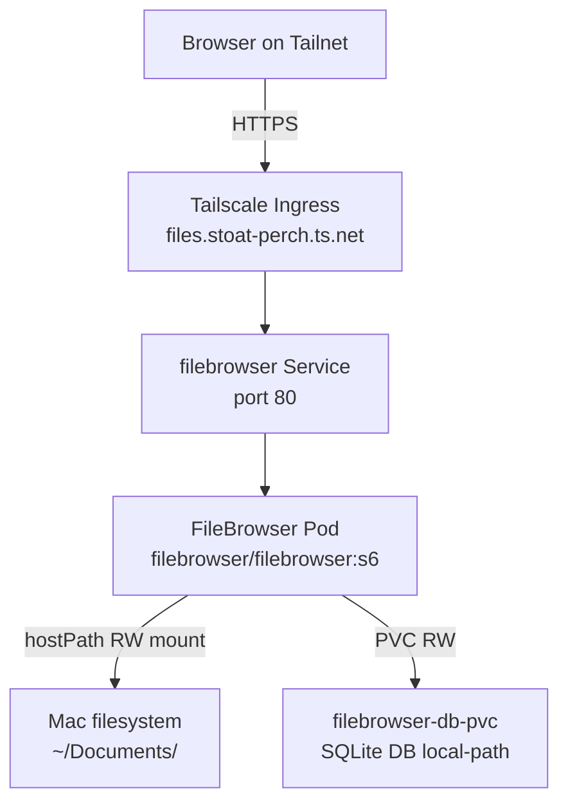

# FileBrowser — architecture

## Why it exists (the design decision)

The docs site uses [docsify](../docs-server/README.md), which is brilliant for rendering markdown but has hard limits:
- Can't browse non-markdown files (PDFs, docx, zips)
- Can't delete or upload (it's a static client-side renderer)
- Search only indexes markdown content

We need a second tool for the "browse / search / delete arbitrary files in `~/Documents`" use case. Options considered:
- **Nextcloud** — full collaboration suite. Overkill (multiple services: web app, Postgres, Redis, cron, push) for "show me my files."
- **Paperless-ngx** — purpose-built document management with OCR + tagging. Great if the goal was a structured archive, but heavy and opinionated.
- **Build a custom Next.js app** — significant dev work for table-stakes features.
- **FileBrowser** ✅ — single container, one PVC for DB, mount the docs dir as hostPath. Built-in browse / search / delete / upload / share-link / auth. Active project, ~1k stars.

Docsify stays for markdown technical docs (what you're reading right now). FileBrowser handles everything else. The docsify sidebar has a link out to FileBrowser so they feel unified, but they're independent apps with independent URLs.

## Deployment diagram



## Topology

```
Tailnet device (phone / TV / laptop)
   │
   │ HTTPS to https://files.stoat-perch.ts.net
   ▼
┌─────────────── Mac ──────────────────────────────────────┐
│                                                          │
│   ┌───────────── OrbStack VM (Linux) ──────────────┐    │
│   │                                                  │    │
│   │   ┌─────── namespace: tailscale ─────────┐     │    │
│   │   │ ts-filebrowser-XXXX-0                │     │    │
│   │   │ (Tailscale proxy pod — TLS + auth)   │     │    │
│   │   └───────────────────┬───────────────────┘     │    │
│   │                       │ HTTP                    │    │
│   │   ┌─────── namespace: homelab ───────────┐     │    │
│   │   │ Service: filebrowser (ClusterIP)     │     │    │
│   │   │  └─→ Pod: filebrowser:v2.32.0        │     │    │
│   │   │       - listens on :80               │     │    │
│   │   │       - runs as root (for FS writes) │     │    │
│   │   │       - mounts:                      │     │    │
│   │   │         /srv     ← ~/Documents       │     │    │
│   │   │         /database ← local-path PVC   │     │    │
│   │   └──────────────────────────────────────┘     │    │
│   └──────────────────────────────────────────────────┘   │
│                                                          │
│   ~/Documents/  (macOS APFS)                             │
│     (passed through to /srv via virtiofs hostPath)       │
│                                                          │
└──────────────────────────────────────────────────────────┘
```

## Components

### Pod: `filebrowser`

- Image: `filebrowser/filebrowser:v2.32.0`
- Single container, single replica (FB doesn't support active-active multi-replica)
- Runs as `root` inside the container — needed because the bind-mount from macOS goes through virtiofs, which doesn't preserve POSIX ownership; running as root lets FB write back without permission errors

### PVC: `filebrowser-content-pvc` (`local-hdd` storage class, ReadWriteOnce, 100 Gi)

- Backing: hostPath PV pointing at `${HOMELAB_DOCUMENTS_PATH}` on the Mac (set in `.env`)
- The "local-hdd" name is misleading — it's the convention name for our hostPath PVs, doesn't actually mean external HDD. The data lives on the internal SSD (APFS) at the configured documents path.

### PVC: `filebrowser-db-pvc` (`local-path` storage class, ReadWriteOnce, 1 Gi)

- Inside the OrbStack VM ext4 (sparse file on macOS APFS, same as all other VM-local PVs)
- Holds SQLite database `filebrowser.db` — user accounts, settings, shared links

### Service: `filebrowser` (ClusterIP, port 80)

Cluster-internal address: `filebrowser.homelab.svc.cluster.local`

### Ingress: `filebrowser` (`ingressClassName: tailscale`)

The Tailscale operator (in `tailscale` namespace) watches Ingress objects with this class. When it sees one, it:
1. Mints a Tailscale auth key from its OAuth client (`operator-oauth` Secret)
2. Spawns a proxy pod (`ts-filebrowser-XXXX-0`) that joins the tailnet as a new node named `files`
3. The proxy terminates HTTPS using a Tailscale-issued cert and forwards plaintext HTTP to the in-cluster `filebrowser` Service

So `files.stoat-perch.ts.net` resolves only on tailnet devices, gets a real TLS cert, and the FB pod itself never sees plaintext public traffic.

## Why the bind-mount strategy and not a copy

`~/Documents/` is "the source of truth" for the user's documents — they may add files via Finder, drag from Mail, save from apps. We bind-mount it live so:

- Anything saved on the Mac shows up in FB immediately
- Anything uploaded / deleted in FB reflects on the Mac immediately
- No sync state to manage, no drift

The trade-off is that we go through virtiofs, which had the FD-accumulation bug that nuked Immich. **It's safe here** because:
- The workload is read-heavy (occasional browse), not the deep-shard-tree write pattern Immich does
- `~/Documents/` has ~hundreds of files, not the tens of thousands per user that Immich shards into
- File access is bursty (user clicks → load) rather than constant background activity

If `~/Documents/` ever grew to 100k+ files with deep nesting, we'd reconsider. For now, it's fine.

## Why we run as root

The bind-mount from macOS `${HOMELAB_DOCUMENTS_PATH}` enters the pod via virtiofs. macOS-side files are owned by the Mac user (e.g. UID 501, GID 20). Inside the Linux container, virtiofs doesn't reliably map that to a corresponding Linux user — file owner shows up as some virtio-translated UID/GID that doesn't match any user in the container's `/etc/passwd`.

If FileBrowser ran as its default user (UID 1000), writes would fail because the file ownership doesn't match. Running as root means the kernel ignores ownership for the FB process, so reads and writes pass through cleanly to the macOS-level filesystem.

It's a contained risk:
- The pod has no network access to anything but the cluster Service
- The only thing it can touch outside its own filesystem is the bind-mounted `~/Documents/`
- No secrets in `~/Documents/` are exposed beyond what the user already chose to put there

For homelab use that's acceptable. For multi-tenant or hostile environments, you'd want a more constrained setup (e.g., a build-time user with explicit UID mapping in virtiofs).

## Auth model

FileBrowser handles its own users (SQLite-backed). Tailscale handles the network boundary — only devices on your tailnet can even reach the URL.

For a typical homelab the layered auth is:
1. **Tailscale** — must be on your tailnet (excludes the entire internet)
2. **FileBrowser admin login** — must know your password (excludes other tailnet users / housemates)

If you wanted to share specific files with a non-tailnet person, FileBrowser's share-link feature creates a public URL — but Tailscale ingress only serves to tailnet IPs, so even share links require the recipient to be on your tailnet. (For true public share, you'd use Tailscale Funnel on the ingress, which we don't enable here.)

## Files in this repo

| File | Purpose |
|---|---|
| `k8s/filebrowser-server.yaml` | All k8s manifests (PV, PVC×2, Deployment, Service, Ingress) |
| `.env.example` | Template for environment variables (copy to `.env`, fill in values) |
| `deploy.sh` | Idempotent deploy script (envsubst + kubectl apply) |
| `undeploy.sh` | Tear-down script |
| `docs/README.md` | Overview / quick start |
| `docs/USAGE.md` | Day-to-day operations |
| `docs/MAINTENANCE.md` | Restart, backup, troubleshooting |
| `docs/ARCHITECTURE.md` | This document |
